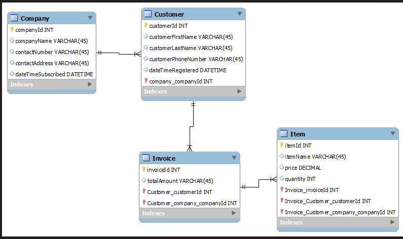

# link-generator-system
This feature is crafted to seamlessly generate a clickable link leading directly to the invoice, empowering customers to effortlessly proceed with payment, driven by the Total Price specified on the invoice.

Below is the Entity-Relational-Diagram that provides quick overview of how the entities are related.

The integration test at API level is documented using postman. 
Find below the link to the documentation - 
https://documenter.getpostman.com/view/18281624/2sA3Bq5BqB

- To generate invoice for a customer of a company - {{baseUrl}}/api/invoices/generate
- To get invoice generated for particular customer of a company is {{baseUrl}}/api/invoices/:id
- To get all invoices - {{baseUrl}}/api/invoices/all
- To get all invoices related to a particular company - {{baseUrl}}/api/invoices/company?value={{companyName}}